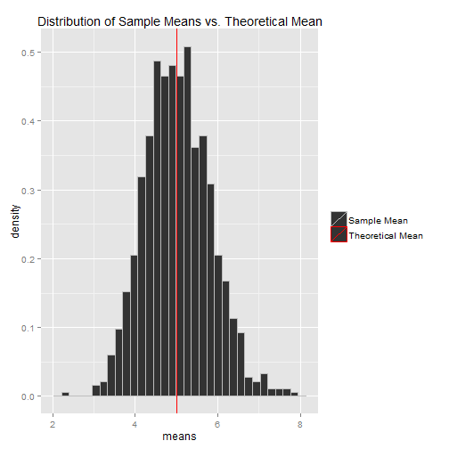

Simple Simulation to Learn Central Limit Theorem
========================================================
author: Tops1752
date: December 25,2015


Central Limit Theorem (CLT)
========================================================
- In probability theory, the central limit theorem (CLT) states that, given certain conditions, the arithmetic mean of a sufficiently large number of iterates of independent random variables, each with a well-defined expected value and well-defined variance, will be approximately normally distributed, regardless of the underlying distribution.

- The App runs the simple simulation to help learn about CLT. In specific, how the sample mean value normally distributed by the theoretical mean. 


UI Design
========================================================
- Step 1 - User can choose any one of the distribution - Normal, Poisson and Exponential, set distribution parameter.
- Step 2 - Once the distribution is chooes, the side bar will show an example of how the distribution looks like.
- Step 3 - User can set simulation parameter - sample size and simulation iteration.
- Step 4 - Click "Run Simulation" bottom, the plot result of simulation will display on the side bar.

Server Example
========================================================
User choose exponential distribution and set mean as 5; sample size is 40 and run 1000 iteration.

```r
n <- input$n;times <- input$round;mu <- input$mnE
distribution <- matrix(data=rexp(n * times, 1/mu), nrow=times)
data <- data.frame(means=apply(distribution, 1, mean))
data <- mu
ggplot(data,aes(means)) +geom_histogram(aes(y=..density..,colour = "Sample Mean")) +geom_vline(aes(xintercept = data[1,2], colour = "Theoretical Mean")) +scale_colour_manual(name="",values=c("Sample Mean"="grey","Theoretical Mean"="red")) +ggtitle("Distribution of Sample Means vs. Theoretical Mean")
```

Server Example Result
========================================================
The result shows that distribution of sample means are approximately normally and the mean of it is close to theoretical mean value.

 


